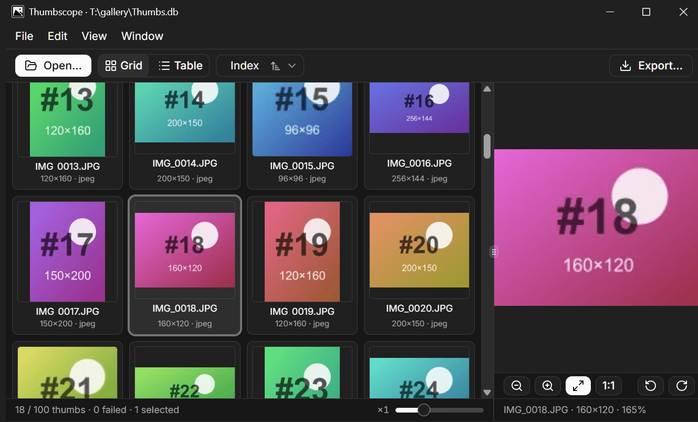

<a id="readme-top"></a>

<br />
<div align="center">
  <a href="https://github.com/ivmakk/thumbscope">
    
  </a>

  <h1 align="center">Thumbscope</h1>

  <p align="center">
    A cross-platform thumbnail-cache viewer for Windows and macOS - open, browse, and export thumbnails from <code>Thumbs.db</code>, <code>ehthumbs.db</code>, and other proprietary databases.
    <br />
    <br />
    <a href="https://github.com/ivmakk/thumbscope/releases">Download</a>
    &middot;
    <a href="https://github.com/ivmakk/thumbscope/issues/new">Report Bug</a>
    &middot;
    <a href="https://github.com/ivmakk/thumbscope/issues/new">Request Feature</a>
  </p>
</div>

<div align="center">
  
</div>

## 1. Overview

Cross-platform desktop viewer (Electron + React + TypeScript) to open proprietary thumbnail-cache databases, visually inspect the stored images in a thumbnail or list view with a larger preview of the selected one, and export thumbnails to a folder as JPEGs (stored original or resized/upscaled). Supports the classic Windows `Thumbs.db` / `ehthumbs.db` family and other proprietary thumbnail caches (see [Supported formats](#11-supported-formats)). A `thumbscope` CLI ships alongside the GUI for terminal use.

- Browse stored images as thumbnails or in a list, with a larger preview of the selected one. Images load lazily, so large databases stay responsive.
- Export to a folder as JPEG - stored original, or resized/upscaled - with optional CSV metadata.
- Recovers raw JPEGs (or PNGs) from truncated / partly-corrupt containers (carve fallback).
- Read-only - never modifies the source database.
- Fully offline and private - works with no network access, no telemetry; your thumbnail data never leaves your machine.

### 1.1. Supported formats

| Format | Stored image | Description |
|---|---|---|
| `Thumbs.db` (Windows 2000 / XP) | JPEG | Original Windows folder thumbnail cache, with real filenames and dates. - OLE2/CFB with a `Catalog` stream (16-byte header); names (or GUIDs) + dates from the catalog. |
| `Thumbs.db` (Windows Vista / 7) | JPEG / PNG | Newer per-folder cache; thumbnails only, no filenames. - OLE2/CFB, no catalog; per-size streams (`<size>_<hash>`), JPEG or PNG behind a Microsoft thumbstream header; hash labels. |
| `thumbcache_*.db` (Windows Explorer) | JPEG / PNG / BMP | Windows Explorer's central thumbnail cache on Windows Vista, 7, 8, 10, and 11 - files named `thumbcache_16.db`, `thumbcache_32.db`, `thumbcache_96.db`, `thumbcache_256.db`, `thumbcache_768.db`, `thumbcache_1024.db`, `thumbcache_1280.db`, `thumbcache_1920.db`, `thumbcache_2560.db`, and similar; thumbnails only, no filenames. - Flat `CMMM` container (not OLE2), per-version entry layout, hex cache-id labels; JPEG, PNG, or raw BGRA payloads (`thumbcache_idx.db` / `IMMM` index files are recognized and skipped). |
| `ehthumbs.db` | BMP / DIB | Windows Media Center cache, with filenames and dates. - OLE2/CFB, 8-byte catalog header; 24/32bpp DIB payloads. |
| `ivThumbs.db` (IrfanView) | BMP | IrfanView's thumbnail database, with real filenames and dates. - OLE2/CFB marked by a `_Thumbs_DB_Ver` stream, no catalog; filename-named streams of FILETIME-prefixed BMP; flat and nested layouts. |
| `photothumb.db` (PhotoScape) | JPEG | PhotoScape's thumbnail cache, with real filenames and dates. - SQLite 3 database (not OLE2), a single `thumb` table of JFIF JPEG blobs. |

More formats are on the roadmap - [suggest one](https://github.com/ivmakk/thumbscope/issues/new) with the format name and its source app.

## 2. Installation

Download the latest build from the [**Releases**](https://github.com/ivmakk/thumbscope/releases/latest) page. Builds are unsigned (see the per-platform notes below).

### 2.1. Requirements

- **Windows** - Windows 10 or 11, 64-bit (x64). 32-bit and Arm64 Windows builds are not provided.
- **macOS** - Apple Silicon (M-series), macOS 12 (Monterey) or later. Intel Macs are not supported yet.

On older Windows versions or 32-bit Windows, see [Thumbs Viewer](#4-acknowledgements).

### 2.2. Windows

Download `thumbscope-<version>-setup.exe` and run it. The installer lets you choose:

- the install location,
- optional Explorer context-menu entries for `Thumbs.db` / `ehthumbs.db` files,
- whether to add the `thumbscope` CLI to your `PATH`.

The build is unsigned, so Windows SmartScreen may show an "unrecognized app" prompt on first run - choose **More info → Run anyway** to proceed.

### 2.3. macOS (Apple Silicon)

Download `thumbscope-<version>-arm64.dmg`, open it, and drag **Thumbscope** to **Applications**. Apple Silicon (M-series) only; Intel Macs are not supported yet.

The build is unsigned and not notarized, so macOS blocks it on first launch - on recent macOS (Sequoia 15+) it reports the app as *"damaged and can't be opened"*. This is expected for an unsigned app, not a corrupt download. After dragging Thumbscope to **Applications**, clear the download quarantine flag from a terminal:

```bash
xattr -dr com.apple.quarantine /Applications/Thumbscope.app
```

It then opens normally. Sequoia 15.1+ removed the old right-click → **Open** bypass and shows no **Open Anyway** button for unsigned apps, so the command above is the reliable fix. On older macOS you can instead right-click the app → **Open** → **Open**.

To use the `thumbscope` CLI from a terminal, symlink the bundled launcher onto your `PATH`:

```bash
ln -s "/Applications/Thumbscope.app/Contents/Resources/cli/thumbscope" /usr/local/bin/thumbscope
```

`/usr/local/bin` may need `sudo`; or point the symlink at any directory already on your `PATH` (e.g. `~/.local/bin`). The launcher runs the CLI through the app's bundled runtime - no separate Node install needed.

## 3. Development

### 3.1. Prerequisites

- **Node.js 24** (see `.nvmrc`, currently `24.17.0`). The build and tests rely on Node 24 stripping TypeScript types natively, so an older major will not work.
- **npm** (bundled with Node).

Native modules (`sharp`) are rebuilt against Electron during packaging; no extra system dependencies are required for development on a supported platform.

### 3.2. Setup

From the project root:

```sh
npm install
```

### 3.3. Run the app

```sh
npm run dev
```

Starts the electron-vite dev server and launches Electron with renderer hot-module reload.

### 3.4. Run the CLI from source

```sh
npm run cli -- <args>
# example:
npm run cli -- list sample/Thumbs.db
```

`sample/Thumbs.db` is a committed synthetic, SFW 100-thumbnail file for manual testing.

### 3.5. Testing

Three tiers, picked by file extension: `node --test` for pure logic (`*.test.ts`), Vitest for component render (`*.test.tsx`), and Playwright `_electron` for the real app end-to-end (`e2e/specs/*.spec.ts`, Windows + macOS).

```sh
npm test                            # node --test over src/**/*.test.ts
node --test src/core/parser.test.ts # single file
npm run test:renderer               # vitest component tier (.test.tsx)
npm run test:e2e                    # Playwright _electron (builds first, then runs e2e/specs)
npm run test:all                    # node --test then vitest
```

Node 24 strips TypeScript types natively, so the `.ts` test files run directly with no build step. The E2E tier needs no `npx playwright install` - `_electron` drives the Chromium bundled in the `electron` dependency, so Playwright's own browser binaries are never used (CI skips downloading them with `PLAYWRIGHT_SKIP_BROWSER_DOWNLOAD=1`).

See [`docs/testing.md`](docs/testing.md) for what each tier covers, how to run E2E locally with the GUI and traces, and how to add a format case or a new spec.

### 3.6. Type-checking

```sh
npm run typecheck
```

Runs `tsgo --noEmit` (the TypeScript 7 native compiler, `@typescript/native-preview`) for both the node and web projects. `npm run build` does **not** type-check - run this separately.

### 3.7. Building & packaging

```sh
npm run build       # production build into out/ (no type-check)
npm run dist:win    # full Windows NSIS installer (build + bundled CLI) -> release/
npm run dist:mac    # macOS arm64 .dmg (build + bundled CLI) -> release/
npm run pack:dir    # unpacked build, no installer, for quick inspection
npm run build:icons # regenerate the icon set from build/icon.svg (only when art changes)
```

### 3.8. Project structure

- `src/core/` - pure, platform-agnostic logic: format detection/parsing/decoding (`formats/`), the export pipeline, and view helpers, shared by main and CLI. No Electron or DOM imports; the Node-only native deps (`cfb`, `sharp`) are imported here and never from the renderer.
- `src/main/` - Electron main process: window, IPC handlers, the `thumb://` protocol, shell-launch open.
- `src/preload/` - the `contextBridge` API surface (`window.api`).
- `src/shared/` - cross-process code with no Electron/DOM imports: the typed IPC contract (`ipc.ts`) and the `thumb://` URL builder.
- `src/renderer/` - sandboxed React page (menubar, grid, table, preview, export dialog).
- `src/cli/` - `commander` CLI calling straight into `src/core`.

## 4. Acknowledgements

Thumbscope was inspired by [**Thumbs Viewer**](https://thumbsviewer.github.io/) by [@erickutcher](https://github.com/erickutcher) - a long-running, open-source native Windows tool for legacy thumbnail databases. If you're on an older Windows version or 32-bit Windows that Thumbscope doesn't target, or need formats it doesn't cover (e.g. `Image.db`, `Video.db`), Thumbs Viewer is a great option. Its companion **Thumbcache Viewer** specializes in `thumbcache_*.db` (which Thumbscope also reads).

## 5. License

GPL-3.0-only. See [`LICENSE`](LICENSE). Contributions are accepted under [`CONTRIBUTING.md`](CONTRIBUTING.md).
